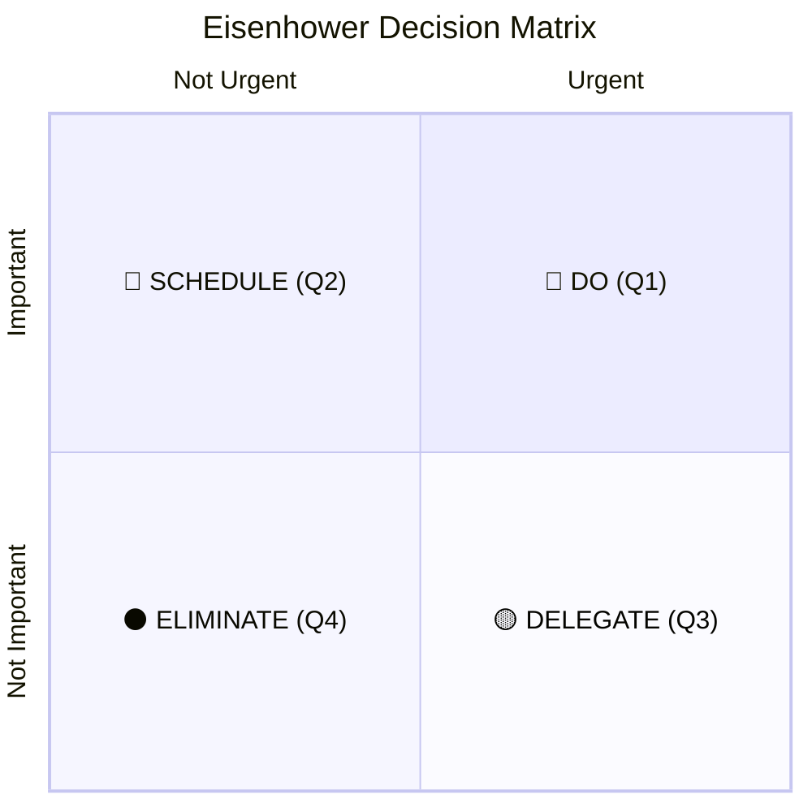

# ✦ Eisenhower Matrix

> *Because your brain deserves a better operating system.*

A single-file, zero-dependency, local-first productivity app built around the **Eisenhower Decision Matrix** — the prioritisation framework that separates what genuinely matters from what merely feels urgent.

Instead of yet another list that grows until it's ignored, this app gives you a spatial canvas: you place each task by how *urgent* and how *important* it really is, then work from a clear, honest picture of where your attention should go. It runs entirely in your browser, stores everything locally, and asks for nothing in return.

**No accounts. No subscriptions. No tracking. No backend.** Just you, your tasks, and absolute clarity about what to do next.

**→ [Launch App](https://yihsuanpai.github.io/eisenhower-matrix/)**

---

## The Framework

The matrix maps every task onto two axes — **urgency** (horizontal) and **importance** (vertical) — producing four quadrants:



The principle is deceptively simple. Most days are spent reacting to things that are loud but unimportant. Forcing every task into one of these four boxes makes the trade-offs visible — and makes it obvious what to do, defer, hand off, or drop entirely.

---

## Features

### 🎯 Free-Float Matrix Canvas
Drag tasks anywhere on the canvas. Their X/Y position encodes urgency (further right = more urgent) and importance (further up = more important), and each task **snaps to the nearest vertical gridline** as you move it, so the board stays tidy and tasks line up into clean priority columns.

### 🗂 Topic Organizer
Group related tasks under custom **topics** with their own emoji and name. File a task by dragging it onto a topic, **drag the topic boxes by their handle to reorder priority**, and **collapse any topic box** to keep the workspace focused. Each topic shows a live done/total count so progress is visible at a glance.

### 🔀 Work / Private Separation
Tag every task as **Work** or **Private**, then switch between three matrix views — **All Tasks**, **Work**, and **Private** — to keep professional and personal priorities cleanly separated on the same canvas. Any task can be flipped between the two at any time.

### ✦ Today Tab — Daily Commitment
Decide what you're actually finishing today. Pick tasks from your active list, organise them by topic, and end the day with **"Call it a day"** — a summary of your completion rate, remaining work, and a well-earned note of recognition. Unfinished tasks carry forward automatically.

### 📣 Share Your Day
From the day's-end summary, share a ready-made caption — *"I completed 4 of 6 tasks in 5 hours today. What a day! 💪"* plus a random pep-talk quote — to **X, Threads, Facebook, and LINE VOOM** via native share links, or copy it for **Instagram, Discord, and Slack**.

### 📋 Sortable Active Task Table
Every column in the **Active** tab is sortable — task name, quadrant, urgency, importance, creation date, and deadline. One click to sort, another to reverse. **Done** and **Archived** tabs keep completed and shelved work out of the way but never lost.

### 📅 Deadline Countdown Bar
Set a hard deadline on any task. Within 48 hours of it, a live HH:MM:SS countdown bar surfaces above the matrix so nothing sneaks up on you.

### 🗒 Per-Task Notes
Every task carries freeform notes. A note glyph appears on the task tag whenever notes exist; one click opens the editor. Notes travel with the task across every view.

### ⋮ Contextual Task Menu
On desktop, hover a matrix tag for quick actions; on touch devices, tap a tag to reveal them. The **⋮** menu holds the full set: **Rename · Note · Done · Move (Work ↔ Private) · Assign to topic · Delete**.

### ⚡ Work DNA Analysis
Answer eight behavioural questions for a personalised work-pattern profile: your archetype (Visionary, Optimizer, Connector, Craftsman, or Architect), the kind of company built for your talent, and the well-known leader whose working style most resembles yours. Results are cached and shareable to X, Threads, Facebook, or Instagram.

### 🌎 Seven-Language Localisation (i18n)
A fully localised UI in English, Traditional Chinese (`zh-TW`), Simplified Chinese (`zh-CN`), Japanese (`ja`), Indonesian (`id`), German (`de`), and Spanish (`es`). Translations apply instantly on change — including live-recalculating usage stats — with dedicated CJK layout handling so rotated axis labels stay upright and readable.

### 🌠 Micro-Animations & Celebrations
Small, motivating rewards for action: neon confetti bursting from your cursor when you complete a task, and a cascade of particles from both corners of the screen when you close out a day.

### 🎨 Four Themes
Open **Themes** in the profile menu to choose from four colour schemes: **Midnight** (deep-space dark), **City-Pop** (bright pastel light), **Techy** (cyber-neon terminal), and **Classical** (warm ink, gold & sage). Your choice persists across sessions.

### 💾 Backup & Restore
Export a portable backup file in one click, then restore it later — on any device or browser — by choosing the file or dragging it in. Imports are validated with a live preview and protected by a one-click **Undo**.

### 👤 Profile & Stats
The profile modal shows your usage stats — days active, tasks created, completion rate — alongside editable fields: job title, one-year vision, nationality, gender, date of birth, and language.

---

## Technical Stack

```
HTML + CSS + Vanilla JS   (single self-contained file, ~6,800 lines)
localStorage              (all persistence)
GitHub Pages              (hosting)
Wikipedia REST API        (celebrity portraits — on demand, no key)
Clearbit Logo API         (company logos — on demand, no key)
```

No framework. No Node. No bundler. No `npm install`. Deliberately — the entire app is one file you can open, read, and host anywhere.

---

## Data & Privacy

Your tasks, notes, topics, name, and profile settings live **only in your browser's localStorage**. Nothing is sent to GitHub, a server, or any third party. Publishing this repository makes the *source code* public — never your data.

To back up, use **Copy Data** in the profile menu; to restore, use **Import Data**. The export round-trips your full state, including tasks, topics, type/quadrant placement, notes, and profile.

---

## Version

`Ver. 2.2.0` — actively developed with [Claude](https://www.anthropic.com/claude) and [Cursor](https://www.cursor.com/).
