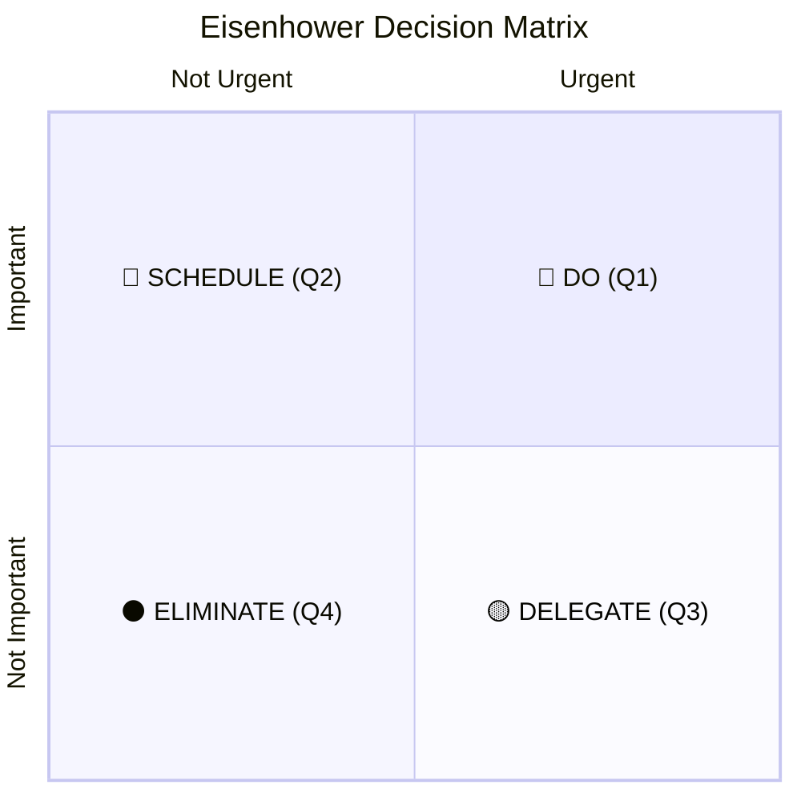

# ✦ Eisenhower Matrix

> *Because your brain deserves a better operating system.*

A single-file, zero-dependency, local-first productivity tool built around the Eisenhower Decision Matrix — the same prioritisation framework used by executives and high-functioning professionals to distinguish what actually matters from what just feels urgent.

No subscriptions. No accounts. No tracking. Just you, your tasks, and absolute clarity about what to work on next.

**→ [Launch App](https://yihsuanpai.github.io/eisenhower-matrix/)**

---

## The Framework

The matrix splits every task into four quadrants by two axes — **urgency** (X-axis) and **importance** (Y-axis):



The insight is deceptively simple: most people spend their days reacting to urgent-but-unimportant noise. The matrix forces you to stop, zoom out, and act on what *actually* moves the needle.

---

## Features

### 🎯 Free-Float Matrix Canvas
Drag tasks to any position on the canvas. Their exact X, Y coordinates represent urgency (right = more urgent) and importance (top = more important). Drop them anywhere — precision is the point.

### 🗂 Work / Private Separation
Tag every task as **Work** or **Private**. Three matrix views — **All Tasks**, **Work**, and **Private** — keep your professional and personal life cleanly separated on the same canvas.

### 🌎 Full Multi-Language Support (i18n)
Fully localized UI support for 7 languages:
- English, Traditional Chinese (`zh-TW`), Simplified Chinese (`zh-CN`), Japanese (`ja`), Indonesian (`id`), German (`de`), and Spanish (`es`).
- Dynamic translation updating instantly on change, including live-recalculating active usage durations ("Using for X days").
- East Asian (CJK) text layout fixes to keep vertical label text upright and readable under rotated CSS transforms.

### 🌠 Micro-Animations & Celebrations
Delightful screen-space visual rewards to motivate action:
- **Task Done Confetti:** Colorful neon confetti explosions shoot directly from your cursor click point when a task is checked off.
- **End-of-Day Confetti Streams:** A celebratory stream of cascading particles shoots up from both bottom corners of the viewport when you successfully close and reset a day.

### ⚡ Work DNA Analysis
Answer 8 behavioral questions and get a personalized work-pattern analysis: your archetype (Visionary, Optimizer, Connector, Craftsman, or Architect), the Tier 1 tech companies built for your kind of talent, and the famous leader whose working style most closely mirrors yours. Results are cached and shareable to X, Threads, Facebook, or Instagram.

### ✦ Today's Sprint Tab
Commit to what you're actually finishing today. Pick tasks from your active list, drag to reorder by priority, and close the day with a summary — completion rate, remaining tasks, and a well-earned compliment for clearing anything from the DO quadrant. Incomplete tasks carry forward automatically.

### 🗒 Per-Task Notes
Every task supports rich freeform notes accessible via a `🗒` hover button on both the matrix canvas and the task table. Notes persist with the task across all views.

### ⋮ Contextual Task Menu
Hover any matrix tag to reveal a `⋮` button. Click to access: **Note · Done · Move · Delete** — including a Move action that flips a task between Work and Private.

### 📋 Sortable Active Task Table
Every column in the Active tab is sortable: task name, quadrant, urgency, importance, creation date, deadline. One click to sort, one more to reverse.

### 📅 Deadline Countdown Bar
Set a hard deadline on any task. Within 48 hours, a live HH:MM:SS countdown bar appears above the matrix so nothing sneaks up on you.

### 🌗 Light / Dark Mode
One click in the profile menu toggles between a deep-space dark palette and a city-pop pastel light mode. Preference persists across sessions.

### 👤 Profile & Settings
The profile modal (accessible via the avatar) shows your usage stats — days active, tasks created, completion rate — alongside editable profile fields: job title, one-year vision, nationality, gender, and date of birth. Repositioned language settings for a clean form flow.

---

## Technical Stack

```
HTML + CSS + Vanilla JS   (1 file, ~5,000 lines)
localStorage              (persistence)
GitHub Pages              (hosting)
Wikipedia REST API        (celebrity portraits — on-demand, no key required)
Clearbit Logo API         (company logos — on-demand, no key required)
```

No React. No Node. No bundler. No npm install. Deliberately.

---

## Data & Privacy

Your tasks, notes, name, and profile settings are stored **only in your browser's localStorage**. They are never sent to GitHub, any server, or anywhere else. Publishing this repo makes the *source code* public — not your data.

To back up: click **⊙ Copy Data** in the profile menu. To restore: click **⊞ Import Data**.

---

## Version

`Ver. 2.0.0` — Built with [Claude Sonnet 4.6](https://www.anthropic.com/claude) and [Cursor](https://www.cursor.com/)
